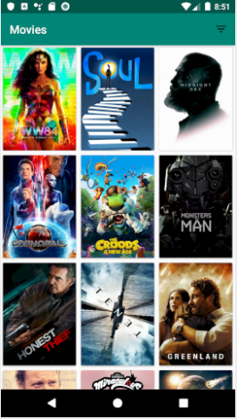
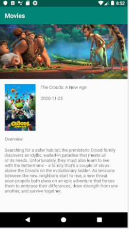
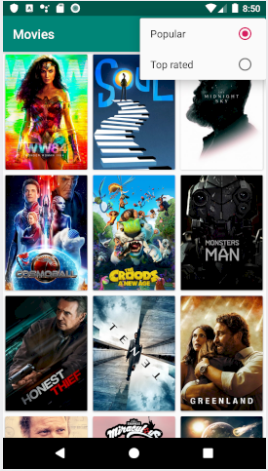

# Movies    

<h4 align="center">
Movies est crée dans le cadre du module Android en E-Services, c'est  répertorie les films classés par popularité et par taux. Vous pouvez vérifier les détails du film en cliquant sur chaque affiche. L'application récupère les données du film à l'aide de l'API de themoviedb.
</h4>

## Screenshots

## Libraries
AndroidX

Retrofit 2: Pour les appels au webservices REST ( API themoviedb dans notre cas )

Gson: Convertir les réponses de l’API qui sont des objets Json en objets Java..

Livedata: Aide à réduire les fuites mémoire et garantit que l’UI est toujours à jour avec les données..

ViewModel: Permet de survivre aux changement de configuration tels les rotations d’écran

Paging: pour charger les données plus facilement et progressivement dans le RecyclerView.

Glide: pour charger les images depuis URL to imageView

Databinding: Minimiser le code nécessaire pour la logique pour se connecter aux éléments de l’UI.   

Okhttp

